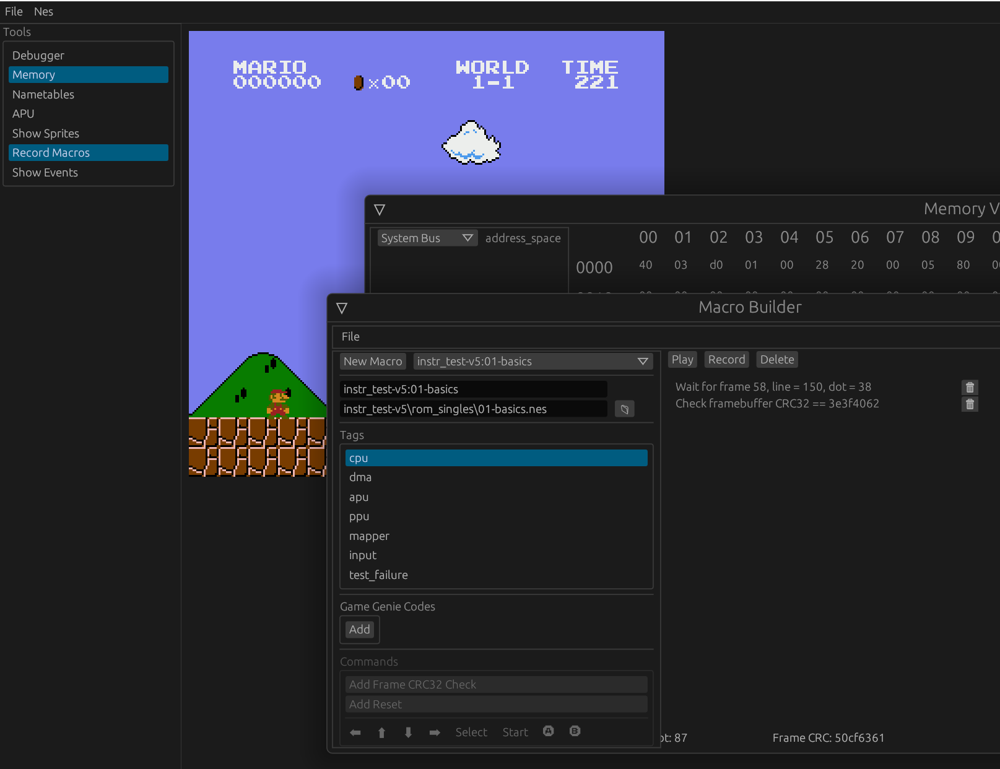
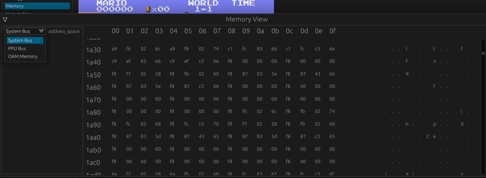
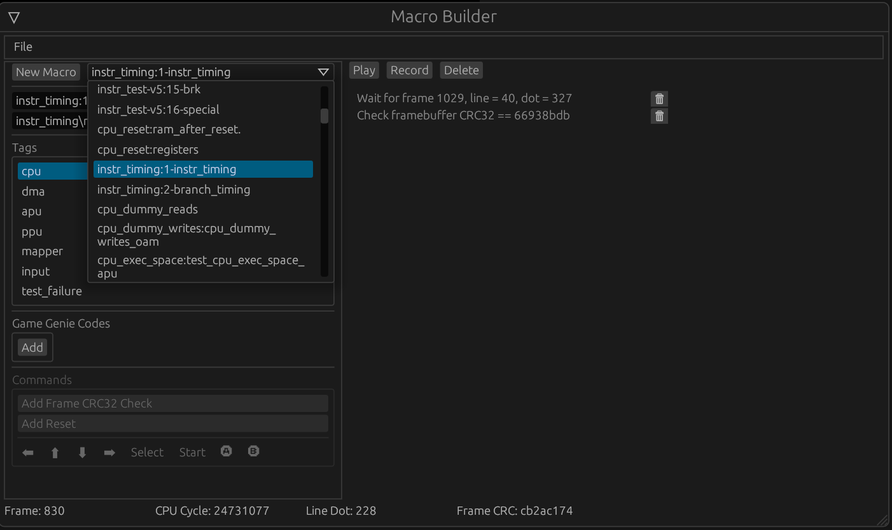
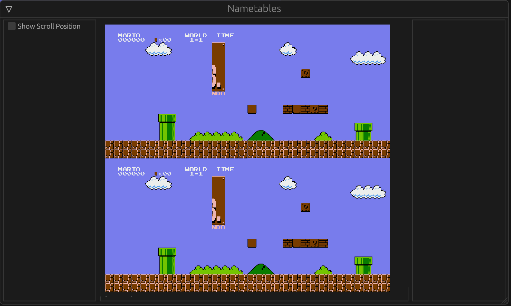
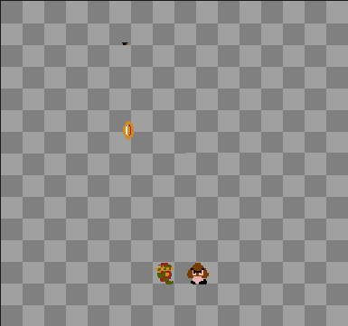
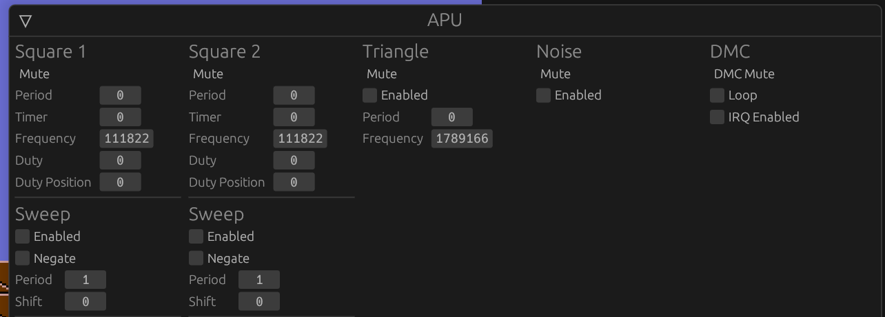

NES emulator! 🎉

A highly accurate NES emulator and NSF music player written in Rust.




# Overview

The project is split into two crates:
- **nes-emulator**; provides the core that deals with the logic of emulating a NES system without any I/O capabilities
- **nes-emulator-ui**; acts as a frontend that can be used either as:
    - A headless command line tool for running tests or benchmarks
    - A graphical UI with a suite of interactive debugging tools, based on `Egui`.


# Core Emulator

## CPU

- [x] Cycle accurate CPU (including all dummy reads/write cycles for instructions that may have side effects)
    - [x] Interrupt handling works in terms of the raising and lowering edge of each clock cycle
- [x] Unofficial opcodes
- [x] RST line handling, for DMAs
- [x] Cycle-accurate DMA handling, including combined DMC + OAM DMAs - *SOME BUGS STILL*

## PPU

- [x] Cycle accurate (including all sprite evaluation)
- [x] 8x16 Sprites
- [x] Emulates all redundant reads that can have side effects for cartridges
- [x] Emulates Sprite 0 hit bug
- [x] Monochrome
- [ ] Color Emphasis
- [x] Shared t,v,fine-x internal register state affecting scrolling and PPU data reads
- [x] I/O latch decay
- [x] Skipped dot for odd frames
- Mirroring Modes
    - [x] Single Screen A
    - [x] Single Screen B
    - [x] Horizontal
    - [x] Vertical
    - [x] Four-screen

## APU

- [x] 2x Pulse channels
- [x] Triangle channel
- [x] Noise channel
- [x] DMC channel
- [x] $4017 register write delay

## System

- [X] NTSC (2C02)
- [x] PAL (2C07) *INCOMPLETE*
- [ ] Dendy (UA6538)
- [x] PPU and CPU emulation in lockstep with cycle accuracy. The CPU clock is the main clock and everything makes progress each read/write cycle for the CPU.
- [x] Game Genie Codes
- Clocking Modes:
    - [x] Real-time (emulation progresses according the passing of real (wall clock) time
    - [x] Greedy (emulation progresses as fast as possible - useful for running tests)

## Mappers
- iNES 000: NROM
- iNES 001: MMC1 / SxROM
- iNES 002: UxROM
- iNES 003: CNROM
- iNES 004: MMC3, MMC6 / TxROM
- iNES 007: AxROM
- iNES 031: NSF Player
- iNES 066: GxROM

## Debugging

- [x] CPU Breakpoints (read or write, optionally ignoring dummy I/O cycles)
- [x] Stack Unwinding
- [x] CPU Tracing - comparable with Mesen trace logs
- [x] General Tracing - Ability to record detailed traces of different hardware events that
        can be visualized in real-time
- [x] Watch Points
- [x] PPU Breakpoints (based on frame, line and dot counts)
- [x] Hook into PPU MUX (background + sprite composition) for debugging
- [x] Optional transistor-level PPU simulator can be run in parallel with the emulated PPU


# UI

## ROM Formats
- [x] iNES
- [ ] iNES 2
- [x] NSF


## Command Line Arguments

```
nes-emulator-ui 0.1.0

USAGE:
    nes_emulator.exe [OPTIONS] [ROM]

ARGS:
    <ROM>

OPTIONS:
    -d, --rom-dir <ROM_DIR>         Add a directory to find macro roms that are specified with a
                                    relative path
    -g, --genie <GENIE_CODES>       Game Genie Code
    -h, --help                      Print help information
    -m, --macros <MACROS>           Load the macros in the given library
    -p, --play <PLAY_MACROS>        Play a single macro or "all" to execute all loaded macros
    -q, --headless                  Disables any IO and all synchronization (i.e. emulates frames as
                                    quickly as possible; good for benchmarking and running tests)
    -r, --relative-time             Step emulator by relative time intervals, not necessarily
                                    keeping up with real time
        --results <RESULTS_JSON>    Write the results of running macros to the given file in JSON
                                    format
    -t, --trace <TRACE>             Record a trace of CPU instructions executed
    -V, --version                   Print version information
```

# Key Bindings

| Key       | Action       |
|-----------|--------------|
| Esc       | Pause/Resume |
| Ctrl-R    | Reset        |
| Enter     | Start        |
| Space     | Select       |
| W         | Up           |
| A         | Left         |
| S         | Down         |
| D         | Right        |
| Left      | A            |
| Right     | B            |

# Tools

## Memory View


## Macro Recorder


## Nametable View


## Sprites View


## APU View


# Links:

- https://www.nesdev.com
- http://www.ffd2.com/fridge/docs/6502-NMOS.extra.opcodes (seems more reliable than undocumented_opcodes.txt)
- https://www.nesdev.com/undocumented_opcodes.txt
- https://github.com/christopherpow/nes-test-roms

# A random selection of other NES emulators
- https://github.com/AndreaOrru/LaiNES
- https://github.com/fogleman/nes

## Some cool NES emulators written in Rust
- https://github.com/kamiyaowl/rust-nes-emulator-embedded _(I originally forked this project for the initial CPU implementation)_
- https://github.com/bokuweb/rustynes
- https://github.com/starrhorne/nes-rust